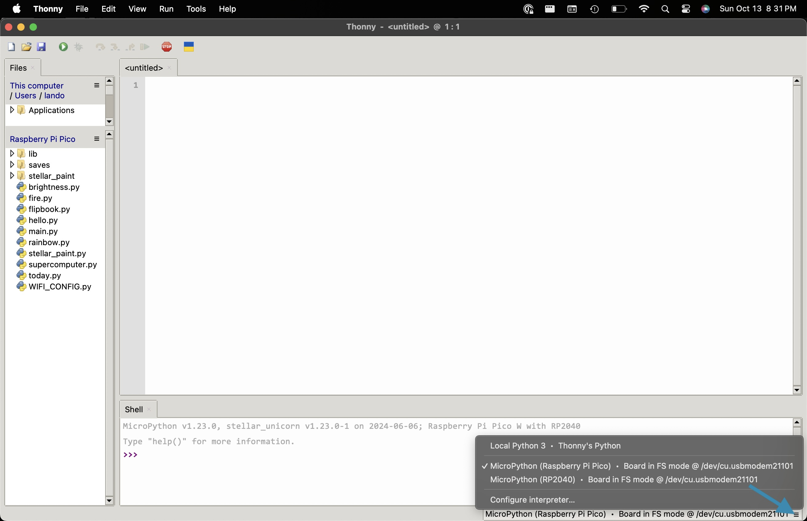
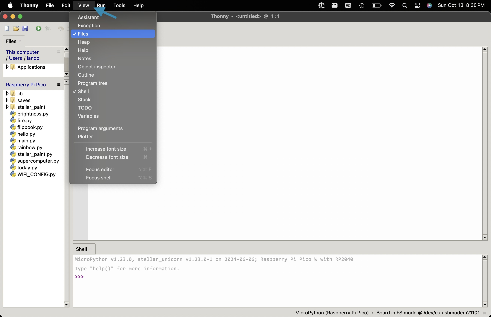
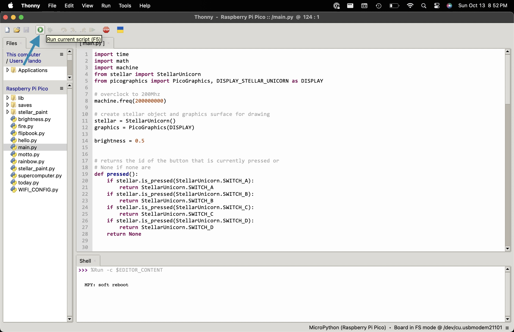
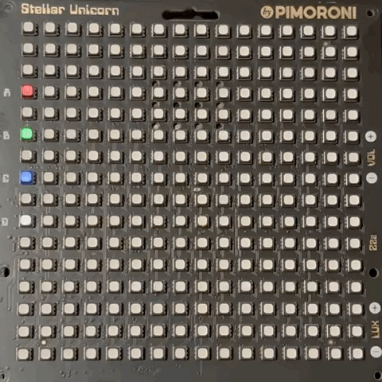
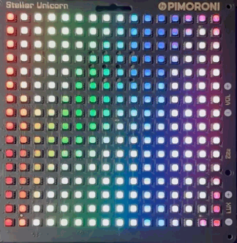

# Stellar Unicorn Flipbook Workshop

This is the setup and steps for the workshop run at SEA-Tech High School in Castle Hayne, NC on October 14, 2024 by Lando Toothman.

## :zap: Quick Start

> See [Pimoroni's Getting started with Raspberry Pi Pico Guide](https://learn.pimoroni.com/article/getting-started-with-pico) for a more detailed walkthrough for connecting Thonny to Raspberry Pi Pico.

Ensure the [Thonny IDE](https://thonny.org/) is installed.

Open Thonny and select the **"MicroPython (Raspberry Pi Pico)"** device from the menu in the bottom right corner.

In the Thonny menu, make sure **View > Files** is selected so that the device files are visible.

Double-click the [`main.py`](./main.py) file to open it in the Thonny file editor. Press the green play button to run the file on the Stellar Unicorn.

Press the green play button (or press the F5 key).

Your Stellar Unicorn will start flashing 4 colorful LEDs.

Behind each LED is a button labeled A, B, C, or D.

Press one of these buttons to start an example display:

| Button | Effect        | Description                                                                      |
| ------ | ------------- | -------------------------------------------------------------------------------- |
| A      | Fire          | An animation of a burning fire                                                   |
| B      | Supercomputer | An animation of yellow dots that look like a old-computer processing a request   |
| C      | Rainbow       | An animation of a flowing rainbow                                                |
| D      | Today's Date  | If connected to Wi-Fi a display of the day of the week and the date of the month |

Pressing **C** will display a flowing rainbow :rainbow:.

And ta-da! You're ready to start coding a Stellar Unicorn! :tada:

## :movie_camera: Creating a Flipbook

1. Open and run [`stellar_paint.py`](./stellar_paint.py).
1. Copy and paste the generated link in your browser.
1. Create an image.
1. Save the image with the format: `<FLIPBOOK_NAME>_<N>`, where:
    1. `<FLIPBOOK_NAME>` is the name of your flipbook (e.g., `cross`)
    1. `<N>` is the frame number (e.g., `2`)
1. Create another image that could would make it look like your previous frame moved. Save that image as well.
1. Stop the script.
1. Open and run [`flipbook.py`](./flipbook.py)
1. Watch your animation!

### Challenge

1. (Easy) Update your flipbook to move faster or slower.
1. (Medium) Create a flipbook with at least 5 frames.
1. (Hard) Program your flipbook to start from the A, B, C, or D button.